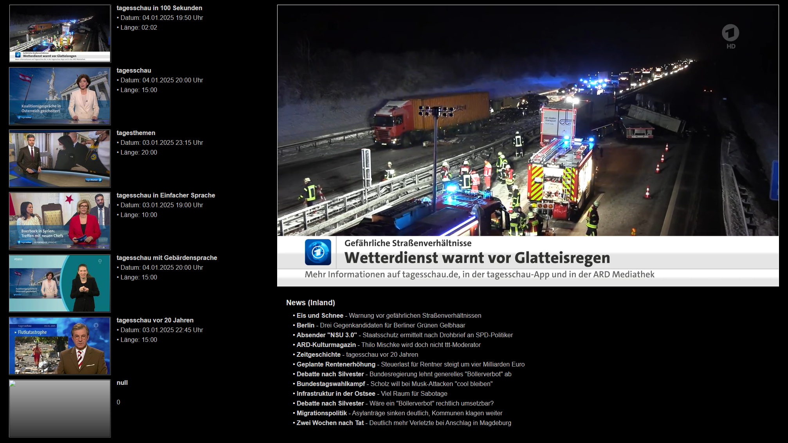

# ioBroker.tagesschau

**Tests:** 

## tagesschau adapter for ioBroker

Ruft News und Videolinks von Tagesschau ab.

Installieren - Im Admin gewünschtes einstellen - fertig.

Beachten: 
1. Der Adapter läuft nur wenn in der Konfiguration 1 Thema und 1 Bundesland ausgewählt sind.
2. Die Schlüsselwörter werden aus den Nachrichten gewonnen und sind erst nach dem ersten Durchlauf verfügbar. Es werden mit der Zeit auch immer mehr!

Beispiel:

## Changelog
<!--
	Placeholder for the next version (at the beginning of the line):
	### **WORK IN PROGRESS**
-->
### 0.1.3 (2025-01-04)
* (ticaki) Reduced size of the icon

### 0.1.2 (2025-01-04)
* (ticaki) Added: Breaking news is excluded from filtering and copied to a separate folder. 
* (ticaki) Changed: Taglist is now sorted.

### 0.1.1 (2025-01-04)
* (ticaki) fixed: The empty configuration after the first installation leaves crashed adapters

### 0.1.0 (2025-01-04)
* (ticaki) initial release

## License
MIT License

Copyright (c) 2025 ticaki <github@renopoint.de>

Permission is hereby granted, free of charge, to any person obtaining a copy
of this software and associated documentation files (the "Software"), to deal
in the Software without restriction, including without limitation the rights
to use, copy, modify, merge, publish, distribute, sublicense, and/or sell
copies of the Software, and to permit persons to whom the Software is
furnished to do so, subject to the following conditions:

The above copyright notice and this permission notice shall be included in all
copies or substantial portions of the Software.

THE SOFTWARE IS PROVIDED "AS IS", WITHOUT WARRANTY OF ANY KIND, EXPRESS OR
IMPLIED, INCLUDING BUT NOT LIMITED TO THE WARRANTIES OF MERCHANTABILITY,
FITNESS FOR A PARTICULAR PURPOSE AND NONINFRINGEMENT. IN NO EVENT SHALL THE
AUTHORS OR COPYRIGHT HOLDERS BE LIABLE FOR ANY CLAIM, DAMAGES OR OTHER
LIABILITY, WHETHER IN AN ACTION OF CONTRACT, TORT OR OTHERWISE, ARISING FROM,
OUT OF OR IN CONNECTION WITH THE SOFTWARE OR THE USE OR OTHER DEALINGS IN THE
SOFTWARE.