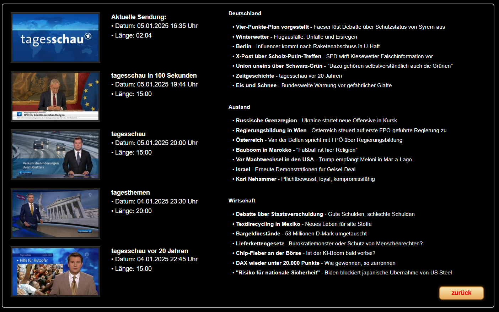

# ioBroker.tagesschau

**Tests:** 

## tagesschau adapter for ioBroker

Ruft News und Videolinks von Tagesschau ab.

Installieren - Im Admin gewünschtes einstellen - fertig.

** Laut Tagesschau api sind 60 Abfragen pro Stunde in Ordnung. Jedes Themengebiet und Video sind 1 Abfrage. 30 Minuten pro Aktualisierung passen immer. Keine Ahnung wie genau die das nehmen. **

Beachten: 
1. Wenn nicht Nachrichten aktivieren oder Videonachrichten aktivieren ausgewählt sind pausiert der Adapter
2. Bei aktivieren Nachrichten läuft der Adapter nur, wenn in der Konfiguration 1 Thema und 1 Bundesland ausgewählt sind.
3. Die Schlüsselwörter werden aus den Nachrichten gewonnen und sind erst nach dem ersten Durchlauf verfügbar. Es werden mit der Zeit immer mehr! Diese greifen nur bei den Nachrichten.

Beispiel was mit VIS möglich ist: 

Weiteres zu den Bilder: https://forum.iobroker.net/post/1235111

## Changelog
<!--
	Placeholder for the next version (at the beginning of the line):
	### **WORK IN PROGRESS**
-->
### **WORK IN PROGRESS**
* (ticaki) Command data point for defining the first news to be displayed
* (ticaki) Reduce object updates
* (ticaki) Total number of news as a data point
* (ticaki) We not in hurry, write object updates slowly.
* (ticaki) Info log messages are a bit more fun. (error and warn messages are not funny at all)

### 0.3.2 (2025-01-05)
* (ticaki) added length to videos
* (ticaki) System load reduced at startup

### 0.3.1 (2025-01-05)
* (ticaki) Back to stable admin

### 0.3.0 (2025-01-05)
* (ticaki) States are only updated when changes are made.
* (ticaki) Last update Data point added with timestamp of the last successful data access
* (ticaki) Emptying of data points improved
* (ticaki) Placeholder images inserted for no news.
* (ticaki) User-defined keywords with `*`
* (ticaki) Requires admin version 7.4.9 or higher

### 0.2.3 (2025-01-05)
* (ticaki) Fixed: Adapter deletes own states

### 0.2.1 (2025-01-05)
* (ticaki) fixed refresh interval & add axios timeouts

### 0.2.0 (2025-01-05)
* (ticaki) remove tracking from videos
* (ticaki) beautiful state name

### 0.1.4 (2025-01-04)
* (ticaki) Fixed: More as 1 region bug

### 0.1.3 (2025-01-04)
* (ticaki) Reduced size of the icon

### 0.1.2 (2025-01-04)
* (ticaki) Added: Breaking news is excluded from filtering and copied to a separate folder. 
* (ticaki) Changed: Taglist is now sorted.

### 0.1.1 (2025-01-04)
* (ticaki) fixed: The empty configuration after the first installation leaves crashed adapters

### 0.1.0 (2025-01-04)
* (ticaki) initial release

## Disclaimer
**All product and company names or logos are trademarks™ or registered® trademarks of their respective holders. Use of them does not imply any affiliation with or endorsement by them or any associated subsidiaries! This personal project is maintained in spare time and has no business goal.**
**Tagesschau is a trademark of ARD-aktuell.** https://www.tagesschau.de/impressum

## License
MIT License

Copyright (c) 2025 ticaki <github@renopoint.de>

Permission is hereby granted, free of charge, to any person obtaining a copy
of this software and associated documentation files (the "Software"), to deal
in the Software without restriction, including without limitation the rights
to use, copy, modify, merge, publish, distribute, sublicense, and/or sell
copies of the Software, and to permit persons to whom the Software is
furnished to do so, subject to the following conditions:

The above copyright notice and this permission notice shall be included in all
copies or substantial portions of the Software.

THE SOFTWARE IS PROVIDED "AS IS", WITHOUT WARRANTY OF ANY KIND, EXPRESS OR
IMPLIED, INCLUDING BUT NOT LIMITED TO THE WARRANTIES OF MERCHANTABILITY,
FITNESS FOR A PARTICULAR PURPOSE AND NONINFRINGEMENT. IN NO EVENT SHALL THE
AUTHORS OR COPYRIGHT HOLDERS BE LIABLE FOR ANY CLAIM, DAMAGES OR OTHER
LIABILITY, WHETHER IN AN ACTION OF CONTRACT, TORT OR OTHERWISE, ARISING FROM,
OUT OF OR IN CONNECTION WITH THE SOFTWARE OR THE USE OR OTHER DEALINGS IN THE
SOFTWARE.